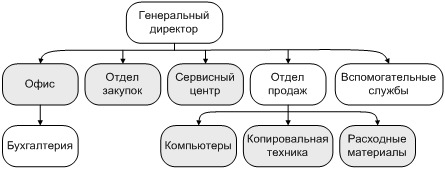

# Directory Service

**Directory Service** - это сервис справочников организационной структуры. Он централизованно управляет данными о подразделениях, должностях и локациях и предоставляет единый CRUD-интерфейс для внутренних систем компании (HR, логистика, заказы, программы лояльности и др.).

Главная цель сервиса - устранить дублирование справочных данных и обеспечить единообразие структуры компании во всей IT-экосистеме.

В инфраструктуре компании работает множество сервисов, и большинству из них регулярно требуются одни и те же организационные данные. Если каждый из них будет поддерживать такие справочники самостоятельно, это неизбежно приведёт к расхождениям в названиях, структуре и актуальности данных.
Directory Service решает эту проблему, выступая **центральным и доверенным источником организационной информации**.

---

## Функциональные области

### 1. Подразделения (департаменты, отделы, филиалы)

Сервис хранит полный перечень подразделений компании и их иерархию.

* Поддерживается древовидная структура (родительские и дочерние подразделения)
* Можно описывать как крупные бизнес-единицы, так и вложенные отделы

---

### 2. Локации (офисы, здания, площадки)

Сервис содержит данные о физических местах присутствия компании.

* Одна локация может быть связана с несколькими подразделениями
* Подразделение, в свою очередь, может быть представлено в нескольких локациях

Это позволяет гибко описывать распределённую организационную структуру.

---

### 3. Должности (позиции)

Справочник должностей охватывает все роли, существующие в компании.

* Одна должность может использоваться в разных подразделениях
* В рамках одного подразделения может существовать множество различных должностей

Такой подход упрощает унификацию ролей и построение отчётности.

---

## Практическая ценность

Сервис позволяет:

* Восстанавливать и анализировать организационную структуру компании
* Определять, какие подразделения и роли представлены в конкретных локациях
* Отслеживать изменения структуры во времени и использовать эти данные в аналитике и отчётах

---

## Результат

Directory Service - это централизованный сервис организационных справочников, описывающий:

* какие подразделения существуют в компании
* где они расположены
* какие должности в них предусмотрены

Система поддерживает сложную иерархию, историчность данных и расширяемость, что делает её базовым элементом корпоративной архитектуры.
